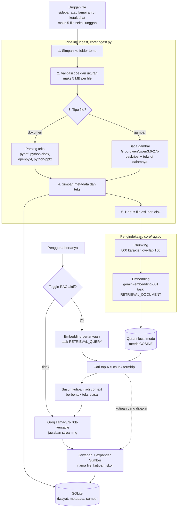

# anonmanis-Chat

Chatbot AI dengan Retrieval Augmented Generation (RAG). Unggah dokumen atau
gambar, lalu tanyakan isinya. Jawaban disusun dari kutipan dokumen yang
relevan, bukan dari tebakan model, dan setiap jawaban menyertakan sumbernya
sehingga bisa ditelusuri kembali.

Dibangun dengan Streamlit, Groq, Google Gemini Embedding, Qdrant, dan SQLite.

---

## Daftar Isi

1. [Fitur](#fitur)
2. [Tech Stack](#tech-stack)
3. [Arsitektur](#arsitektur)
4. [Pipeline RAG](#pipeline-rag)
5. [Skema Database](#skema-database)
6. [Instalasi dan Menjalankan](#instalasi-dan-menjalankan)
7. [Environment Variable](#environment-variable)
8. [Struktur Folder](#struktur-folder)
9. [Batasan yang Diketahui](#batasan-yang-diketahui)
10. [Rencana Pengembangan](#rencana-pengembangan)

---

## Fitur

**Percakapan**

- Jawaban tampil streaming, kata per kata, lewat `st.write_stream`
- Indikator titik beranimasi di dalam bubble jawaban menyala sejak pesan
  dikirim sampai kata pertama muncul, dengan keterangan tahapnya: mencari
  kutipan lalu menyusun jawaban. Tidak ada jeda diam tanpa tanda apa pun
- Riwayat percakapan tersimpan di SQLite dan tidak hilang saat halaman di-refresh
- Judul percakapan dibuat otomatis dari pesan pertama, maksimal 6 kata
- Sidebar berisi daftar percakapan, terbaru di atas, bisa dibuka kembali kapan saja
- Tombol hapus percakapan dengan konfirmasi dua langkah
- Tombol "Coba lagi" muncul kalau jawaban gagal dibuat, jawaban parsial tetap tersimpan

**Dokumen dan gambar**

- Menerima PDF, DOCX, XLSX, PPTX, PNG, JPG, dan JPEG
- File bisa diunggah lewat sidebar atau dilampirkan langsung di kotak chat,
  keduanya melewati pipeline yang sama dan sama-sama masuk ke indeks RAG
- Batas 5 MB per file dan 5 file per sekali unggah. Batas ini berlaku per
  batch, bukan kuota permanen, jadi pengguna boleh mengunggah berkali-kali
- Memilih lebih dari 5 file sekaligus menolak seluruh batch dengan satu
  notifikasi, tidak memproses sebagiannya, supaya pengguna sendiri yang
  menentukan file mana yang jadi dikirim
- Pelanggaran ditolak dengan pesan yang jelas, bukan exception mentah
- Gambar dibaca model vision Groq lebih dulu, deskripsi dan teks di dalamnya
  lalu diperlakukan seperti teks dokumen biasa sehingga ikut tercari lewat RAG
- File asli tidak pernah disimpan permanen, hanya hasil pemrosesannya
- Tahapan proses tampil langsung lewat `st.status`, dari penyimpanan sementara
  sampai penghapusan file
- Daftar dokumen menampilkan ikon per tipe, ukuran, jumlah chunk, dan jam unggah
- Daftar dokumen punya pencarian nama file dan paginasi 5 baris per halaman,
  keduanya dikerjakan di SQL sehingga yang dibaca ke memori hanya satu halaman
- Indikator jumlah dokumen tersimpan beserta batas yang berlaku
- Menghapus dokumen ikut menghapus chunk-nya dari Qdrant

**RAG**

- Pencarian semantik 5 kutipan paling relevan untuk setiap pertanyaan
- Expander "Sumber" di bawah tiap jawaban berisi nama file, potongan teks
  chunk yang dipakai, dan skor kemiripannya
- Sumber ikut tersimpan di SQLite sehingga tetap ada setelah halaman di-refresh
- Toggle untuk mematikan RAG, supaya jawaban dengan dan tanpa dokumen bisa
  dibandingkan langsung
- Model diinstruksikan menjawab hanya dari kutipan, dan mengaku tidak tahu
  kalau informasinya memang tidak ada di dokumen

**Ketahanan dan antarmuka**

- Rate limit (HTTP 429), timeout, gangguan koneksi, dan error server
  diterjemahkan jadi kalimat yang bisa ditindaklanjuti
- Percobaan ulang otomatis dengan jeda bertambah, mengikuti header `Retry-After`
  kalau server menyebutkannya. Kesalahan permanen seperti API key salah tidak
  diulang supaya pengguna tidak menunggu percuma
- Loading state di semua aksi yang memakan waktu: indikator mengetik saat
  menunggu jawaban, `st.status` bertahap saat mengunggah, dan spinner saat
  membuat judul atau menghapus dokumen
- Tema gelap kustom dengan satu warna aksen, font Plus Jakarta Sans
- Tata letak menyesuaikan layar tablet
- Expander "Tentang aplikasi ini" berisi ringkasan arsitektur

---

## Tech Stack

| Komponen | Teknologi | Alasan pemilihan |
| --- | --- | --- |
| Antarmuka | Streamlit 1.63 | Satu bahasa untuk UI dan backend, punya komponen chat bawaan (`st.chat_message`, `st.write_stream`, `st.status`) sehingga streaming dan indikator proses tidak perlu dibuat dari nol |
| Model chat | Groq, `llama-3.3-70b-versatile` | Inferensi sangat cepat sehingga streaming terasa responsif, dan endpoint-nya OpenAI-compatible sehingga bisa dipakai dengan SDK `openai` tanpa dependensi tambahan |
| Model vision | Groq, `qwen/qwen3.6-27b` | Model multimodal di Groq yang membaca gambar sekaligus menyalin teks di dalamnya, memakai endpoint dan SDK yang sama dengan model chat |
| Embedding | Google Gemini, `gemini-embedding-001` | Versi stabil yang mendukung `task_type` terpisah untuk dokumen dan pertanyaan, yang memang dianjurkan untuk kasus retrieval, serta ukuran vektor yang bisa diatur |
| Vector store | Qdrant local mode | Berjalan on-disk tanpa server dan tanpa Docker, jadi proyek bisa dijalankan hanya dengan `pip install`. Mendukung filter payload sehingga chunk milik satu dokumen bisa dihapus sekaligus |
| Metadata dan riwayat | SQLite (modul `sqlite3` bawaan) | Tanpa dependensi tambahan dan tanpa server. Relasi antar tabel dijaga dengan foreign key `ON DELETE CASCADE` |
| Parsing PDF | pypdf | Murni Python, tanpa binary sistem, sudah cukup untuk ekstraksi teks per halaman |
| Parsing DOCX | python-docx | Membaca paragraf sekaligus isi tabel, yang sering memuat data penting |
| Parsing XLSX | openpyxl | Mode `read_only` hemat memori untuk file besar, dan `data_only` mengambil hasil rumus bukan rumusnya |
| Parsing PPTX | python-pptx | Membaca judul, isi, tabel, sekaligus catatan pembicara |
| Konfigurasi | python-dotenv | Memuat file `.env` ke `os.environ` saat pengembangan, sementara di produksi environment variable tetap dipakai apa adanya |

---

## Arsitektur



Catatan penting pada diagram di atas: yang dikirim ke model bahasa adalah
**teks** kutipan, bukan vektor. Embedding hanya dipakai untuk mencari chunk
yang relevan di Qdrant.

---

## Pipeline RAG

### Saat dokumen diunggah

**Langkah 1, file diterima dan disimpan sementara.**
Isi file ditulis ke berkas sementara di folder temp sistem.

**Langkah 2, validasi.**
Ekstensi harus termasuk PDF, DOCX, XLSX, PPTX, PNG, JPG, atau JPEG, dengan
ukuran maksimal 5 MB per file. Satu kali unggah menerima paling banyak 5 file.
Kalau pengguna memilih lebih dari itu, seluruh batch ditolak dengan satu
notifikasi dan tidak ada file yang diproses, sehingga pengguna sendiri yang
memilih ulang file mana yang jadi dikirim. Batas ini berlaku per batch, bukan
kuota permanen, sehingga jumlah dokumen tersimpan tidak dibatasi. Pelanggaran
dikembalikan sebagai pesan yang bisa dibaca pengguna, bukan exception.

File bisa masuk lewat dua pintu, uploader di sidebar atau lampiran di kotak
chat, dan keduanya memakai pipeline yang sama persis. Lampiran di kotak chat
diproses lebih dulu sebelum pertanyaan pada pesan yang sama dijawab, sehingga
chunk-nya sudah bisa dicari saat itu juga.

**Langkah 3, ekstraksi teks.**
Dokumen diurai sesuai tipenya. Gambar dikirim ke model vision Groq
`qwen/qwen3.6-27b` sebagai blok `image_url` berisi data URI base64, dengan
permintaan mendeskripsikan isi gambar sekaligus menyalin semua teks yang
terlihat. Hasil deskripsi itu selanjutnya diperlakukan persis seperti teks
dokumen biasa.

**Langkah 4, simpan ke SQLite.**
Metadata masuk ke tabel `documents`, teks lengkapnya ke tabel `document_text`,
dalam satu transaksi.

**Langkah 5, hapus file asli.**
Berkas sementara dihapus dari disk. Penghapusan ini berada di blok `finally`
sehingga tetap berjalan walaupun langkah sebelumnya gagal di tengah jalan.

**Langkah 6, chunking.**
Teks dipecah dengan target **800 karakter** dan **overlap 150 karakter**.
Pemotongan diambil di batas kalimat. Kalimat yang lebih panjang dari
`800 - 150 = 650` karakter dipecah lagi di batas kata, sehingga jatah overlap
selalu muat dan tidak ada chunk yang melewati target. Kata tidak pernah
terpotong di tengah, kecuali pada satu kasus yang memang tidak punya batas
kata sama sekali, misalnya string base64 panjang tanpa spasi.

**Langkah 7, embedding.**
Setiap chunk di-embedding dengan `gemini-embedding-001` memakai
`task_type = RETRIEVAL_DOCUMENT`. Vektor dinormalisasi L2.

**Langkah 8, simpan ke Qdrant.**
Vektor disimpan bersama payload `document_id`, `filename`, `chunk_index`, dan
`text`. ID point dihitung deterministik dari `document_id` dan `chunk_index`
sehingga mengunggah ulang dokumen yang sama tidak menggandakan data.

### Saat pengguna bertanya

**Langkah 1, pertanyaan di-embedding** dengan model yang sama, tetapi memakai
`task_type = RETRIEVAL_QUERY`. Dokumentasi Gemini menganjurkan `task_type`
yang berbeda antara korpus dan pertanyaan untuk hasil retrieval terbaik.

**Langkah 2, pencarian.** Qdrant mencari **top-K 5** chunk dengan kemiripan
cosine tertinggi.

**Langkah 3, penyusunan context.** Teks kelima chunk itu disusun jadi satu
blok kutipan, masing-masing diberi nomor dan nama file sumbernya.

**Langkah 4, pemanggilan model.** Blok kutipan disisipkan ke system prompt,
sementara pertanyaan pengguna dikirim apa adanya. Model diinstruksikan
menjawab hanya dari kutipan, menyebut nama file sumbernya, dan mengaku terus
terang kalau informasinya tidak ada di dokumen.

**Langkah 5, penyajian.** Jawaban tampil streaming. Di bawahnya muncul
expander "Sumber" berisi nama file, potongan teks tiap chunk, dan skor
kemiripannya. Sumber ini ikut disimpan ke SQLite sehingga tetap ada setelah
halaman di-refresh.

### Ringkasan parameter

| Parameter | Nilai |
| --- | --- |
| Maksimal file per sekali unggah | 5, kelebihannya menolak seluruh batch |
| Baris per halaman daftar dokumen | 5 |
| Maksimal ukuran per file | 5 MB |
| Ukuran chunk | 800 karakter |
| Overlap antar chunk | 150 karakter |
| Batas pemecahan kalimat panjang | 650 karakter |
| Model embedding | `gemini-embedding-001` |
| Dimensi vektor yang diminta | 768, bisa diatur 128 sampai 3072 |
| Task type dokumen | `RETRIEVAL_DOCUMENT` |
| Task type pertanyaan | `RETRIEVAL_QUERY` |
| Top-K | 5 chunk per pertanyaan |
| Distance metric | COSINE |
| Ukuran batch embedding | 8 chunk per permintaan |

Ukuran collection Qdrant diambil dari panjang vektor yang benar-benar
dikembalikan API, bukan dari angka di konfigurasi, sehingga collection tidak
pernah dibuat dengan dimensi yang salah.

---

## Skema Database

### SQLite

**Tabel `conversations`**

| Kolom | Tipe | Keterangan |
| --- | --- | --- |
| `id` | INTEGER | Primary key, auto increment |
| `title` | TEXT | Judul hasil ringkasan model, maksimal 6 kata |
| `created_at` | TEXT | Waktu UTC format ISO 8601 |
| `updated_at` | TEXT | Dipakai untuk mengurutkan sidebar |

**Tabel `messages`**

| Kolom | Tipe | Keterangan |
| --- | --- | --- |
| `id` | INTEGER | Primary key, auto increment |
| `conversation_id` | INTEGER | Foreign key ke `conversations.id`, `ON DELETE CASCADE` |
| `role` | TEXT | `user`, `assistant`, atau `system` |
| `content` | TEXT | Isi pesan |
| `created_at` | TEXT | Waktu UTC format ISO 8601 |

**Tabel `documents`**

| Kolom | Tipe | Keterangan |
| --- | --- | --- |
| `id` | INTEGER | Primary key, auto increment |
| `filename` | TEXT | Nama file asli |
| `filetype` | TEXT | Ekstensi, misalnya `pdf` atau `png` |
| `filesize` | INTEGER | Ukuran dalam byte |
| `char_count` | INTEGER | Jumlah karakter hasil ekstraksi |
| `status` | TEXT | Lihat tabel status di bawah |
| `uploaded_at` | TEXT | Waktu UTC format ISO 8601 |

**Tabel `document_text`**

| Kolom | Tipe | Keterangan |
| --- | --- | --- |
| `id` | INTEGER | Primary key, auto increment |
| `document_id` | INTEGER | Foreign key ke `documents.id`, `ON DELETE CASCADE` |
| `content` | TEXT | Teks lengkap hasil ekstraksi atau deskripsi gambar |

**Tabel `message_sources`**

| Kolom | Tipe | Keterangan |
| --- | --- | --- |
| `id` | INTEGER | Primary key, auto increment |
| `message_id` | INTEGER | Foreign key ke `messages.id`, `ON DELETE CASCADE` |
| `document_id` | INTEGER | Dokumen asal kutipan |
| `filename` | TEXT | Nama file sumber |
| `chunk_index` | INTEGER | Nomor urut chunk di dalam dokumen |
| `score` | REAL | Skor kemiripan cosine |
| `text` | TEXT | Potongan teks chunk yang dipakai |

**Nilai `documents.status`**

| Status | Arti |
| --- | --- |
| `indexed` | Teks diekstrak dan chunk-nya sudah masuk Qdrant |
| `processed` | Teks diekstrak, tetapi pengindeksan gagal, misalnya karena `GEMINI_API_KEY` belum diisi |
| `no_text` | File terbaca tetapi tidak ada teks di dalamnya, misalnya PDF hasil scan |
| `pending` | Gambar yang gagal dibaca model vision |

### Qdrant

Satu collection bernama `documents`.

| Properti | Nilai |
| --- | --- |
| Nama collection | `documents` |
| Distance metric | COSINE |
| Ukuran vektor | Mengikuti panjang vektor yang dikembalikan API embedding |
| Lokasi penyimpanan | `./data/qdrant`, on-disk, local mode |
| Format ID point | UUID v5 deterministik dari `document_id` dan `chunk_index` |

Struktur payload setiap point:

```json
{
  "document_id": 3,
  "filename": "manual-hrd.pdf",
  "chunk_index": 41,
  "text": "Pasal 12.3: kuota cuti tahunan karyawan tetap adalah dua belas hari ..."
}
```

Payload `document_id` dipakai sebagai filter saat menghapus, sehingga seluruh
chunk milik satu dokumen bisa dihapus sekaligus ketika dokumennya dihapus
lewat antarmuka.

---

## Instalasi dan Menjalankan

### Prasyarat

- Python 3.10 atau lebih baru
- API key Groq, ambil di <https://console.groq.com/keys>
- API key Gemini, ambil di <https://aistudio.google.com/apikey>

### Langkah instalasi

**1. Clone repository**

```bash
git clone https://github.com/anonmanis/anonmanis-Bot.git
cd anonmanis-Bot
```

**2. Buat dan aktifkan virtual environment**

```bash
python3 -m venv .venv
source .venv/bin/activate
```

Pada Windows, gunakan `.venv\Scripts\activate` sebagai pengganti baris kedua.

**3. Pasang dependensi**

```bash
pip install --upgrade pip
pip install -r requirements.txt
```

**4. Siapkan file konfigurasi**

```bash
cp .env.example .env
```

Buka file `.env` lalu isi `GROQ_API_KEY` dan `GEMINI_API_KEY`.

**5. Jalankan aplikasi**

```bash
streamlit run app.py
```

Aplikasi terbuka di <http://localhost:8501>.

### Menghentikan dan keluar dari virtual environment

```bash
deactivate
```

### Mengulang dari nol

Menghapus folder `data/` akan menghapus seluruh riwayat percakapan, metadata
dokumen, dan indeks vektor.

```bash
rm -rf data/
```

---

## Environment Variable

Semua nilai dibaca dari `os.environ`. Tidak ada API key yang ditulis di dalam
kode. File `.env` sudah masuk `.gitignore`.

| Variabel | Wajib | Default | Keterangan |
| --- | --- | --- | --- |
| `GROQ_API_KEY` | Ya | tidak ada | API key Groq untuk chat, judul otomatis, dan vision |
| `GEMINI_API_KEY` | Untuk RAG | tidak ada | API key Gemini untuk embedding. Tanpa ini aplikasi tetap jalan, dokumen tetap diurai dan disimpan, hanya pencarian RAG yang mati. `GOOGLE_API_KEY` juga diterima |
| `GROQ_BASE_URL` | Tidak | `https://api.groq.com/openai/v1` | Endpoint OpenAI-compatible milik Groq |
| `GROQ_MODEL` | Tidak | `llama-3.3-70b-versatile` | Model chat utama |
| `GROQ_TITLE_MODEL` | Tidak | mengikuti `GROQ_MODEL` | Model untuk meringkas judul percakapan. Model reasoning tetap didukung, kalau balasannya kosong judul otomatis diambil dari pesan pertama pengguna |
| `GROQ_VISION_MODEL` | Tidak | `qwen/qwen3.6-27b` | Model multimodal untuk membaca gambar |
| `GEMINI_EMBED_MODEL` | Tidak | `gemini-embedding-001` | Model embedding |
| `GEMINI_EMBED_DIM` | Tidak | `768` | Dimensi vektor yang diminta, rentang 128 sampai 3072 |
| `QDRANT_PATH` | Tidak | `data/qdrant` | Folder penyimpanan Qdrant local mode. Path relatif dihitung dari root project dan foldernya dibuat otomatis |
| `QDRANT_COLLECTION` | Tidak | `documents` | Nama collection Qdrant |
| `APP_DB_PATH` | Tidak | `data/chat.db` | Lokasi **file** database SQLite, bukan folder. Folder induknya dibuat otomatis |

---

## Struktur Folder

```
anonmanis-Bot/
├── app.py                    Entry point Streamlit. Berisi seluruh lapisan
│                             antarmuka: sidebar, area chat, expander Sumber,
│                             expander Tentang, dan custom CSS
│
├── core/
│   ├── __init__.py           Penanda package
│   ├── config.py             Membaca environment variable dan menyimpan
│   │                         konstanta seperti ukuran chunk, overlap, top-K,
│   │                         timeout, dan jumlah percobaan ulang
│   ├── db.py                 Koneksi SQLite, skema tabel, dan seluruh operasi
│   │                         baca tulis untuk percakapan, pesan, dokumen,
│   │                         teks dokumen, serta sumber jawaban
│   ├── llm.py                Wrapper pemanggilan Groq: streaming jawaban,
│   │                         pembuatan judul, penyusunan system prompt RAG,
│   │                         dan helper percobaan ulang with_retry
│   ├── vision.py             Pembacaan gambar lewat model multimodal Groq,
│   │                         termasuk penyusunan data URI base64
│   ├── ingest.py             Pipeline unggah enam tahap, validasi batasan,
│   │                         dan parser untuk PDF, DOCX, XLSX, serta PPTX
│   ├── chunking.py           Pemecahan teks jadi chunk di batas kalimat
│   ├── embeddings.py         Pemanggilan Gemini Embedding API, penanganan
│   │                         batch, dan normalisasi L2
│   ├── vectorstore.py        Qdrant local mode: pembuatan collection,
│   │                         penyimpanan, pencarian, dan penghapusan chunk
│   ├── rag.py                Perekat antara chunking, embedding, dan vector
│   │                         store untuk alur pengindeksan dan pencarian
│   └── errors.py             Penerjemah error teknis jadi pesan yang ramah,
│                             termasuk deteksi rate limit dan Retry-After
│
├── .streamlit/
│   └── config.toml           Tema gelap kustom, palet warna, font, radius,
│                             dan batas ukuran unggah server
│
├── data/                     Dibuat otomatis saat pertama dijalankan.
│   ├── chat.db               Database SQLite
│   └── qdrant/               Penyimpanan vektor Qdrant
│                             Folder ini masuk .gitignore
│
├── .env                      Berisi API key. Tidak ikut ter-commit
├── .env.example              Contoh isi .env, hanya nama variabel tanpa nilai
├── .gitignore                Mengecualikan .env, data/, *.db, dan __pycache__
├── requirements.txt          Dependensi dengan versi yang di-pin
└── README.md                 Dokumen ini
```

---

## Batasan yang Diketahui

**Kapasitas dan skala**

- Maksimal 5 file per sekali unggah dan 5 MB per file, ditetapkan di
  `core/ingest.py`. Jumlah dokumen tersimpan tidak dibatasi, jadi indeks Qdrant
  bisa tumbuh terus. Daftar dokumen sudah punya pencarian dan paginasi, tetapi
  pencariannya hanya mencocokkan nama file, belum isi dokumennya.
- Qdrant local mode mengunci folder penyimpanan untuk satu proses. Aplikasi
  ini hanya bisa dijalankan satu instance pada satu waktu untuk folder data
  yang sama. Untuk akses bersamaan, Qdrant perlu dijalankan sebagai server.
- Seluruh riwayat percakapan dikirim ulang ke model pada setiap giliran, jadi
  percakapan yang sangat panjang akan menambah pemakaian token.

**Kualitas pencarian**

- Pencarian sepenuhnya bersifat semantik. Kata kunci yang sangat spesifik
  seperti nomor dokumen atau kode produk kadang kalah relevan dibanding
  kalimat yang mirip secara makna. Pencarian hybrid yang menggabungkan kata
  kunci dan vektor belum ada.
- Top-K tetap 5 dan tidak ada ambang batas skor minimum, sehingga chunk yang
  kurang relevan tetap ikut terkirim ketika dokumen yang cocok memang tidak ada.
- Belum ada reranking setelah pencarian.

**Ekstraksi dokumen**

- PDF hasil scan tidak menghasilkan teks karena belum ada OCR. Dokumen seperti
  ini tersimpan dengan status `no_text`.
- Struktur tabel yang rumit pada PDF sering kehilangan susunan kolomnya
  setelah diubah jadi teks.
- Kualitas pembacaan gambar bergantung pada model vision. Tulisan tangan,
  teks yang sangat kecil, atau gambar beresolusi rendah bisa terbaca keliru.

**Operasional**

- Belum ada autentikasi pengguna. Siapa pun yang bisa membuka aplikasi bisa
  melihat seluruh dokumen dan percakapan.
- Semua data tersimpan di disk lokal tanpa enkripsi.
- Belum ada mekanisme migrasi skema database. Perubahan skema pada versi
  berikutnya perlu penanganan manual.
- Belum ada test otomatis di dalam repository. Pengujian selama pengembangan
  dilakukan lewat skrip terpisah dan pemeriksaan antarmuka dengan browser.

---

## Rencana Pengembangan

**Prioritas dekat**

- OCR untuk PDF hasil scan, sehingga dokumen yang selama ini berstatus
  `no_text` ikut bisa dicari
- Ambang batas skor minimum, supaya model tidak menerima kutipan yang jelas
  tidak relevan
- Pencarian hybrid yang menggabungkan pencocokan kata kunci dengan pencarian
  vektor, untuk memperbaiki kasus nomor dokumen dan kode produk
- Rangkaian test otomatis di dalam repository, mencakup chunking, validasi
  unggah, dan alur pencarian

**Prioritas menengah**

- Reranking hasil pencarian dengan model cross encoder
- Menampilkan sorotan pada bagian dokumen yang menjadi sumber jawaban
- Ekspor percakapan ke Markdown atau PDF
- Pengaturan top-K dan ukuran chunk lewat antarmuka

**Prioritas jauh**

- Autentikasi pengguna dan pemisahan ruang kerja per pengguna
- Qdrant sebagai server terpisah agar aplikasi bisa dijalankan banyak instance
- Migrasi skema database yang terkelola
- Dukungan tipe file tambahan seperti CSV, Markdown, dan HTML
